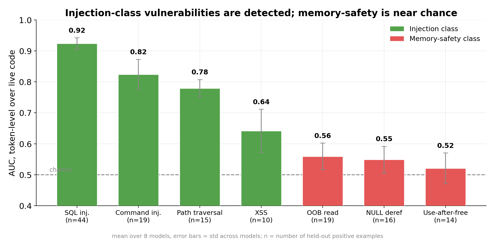
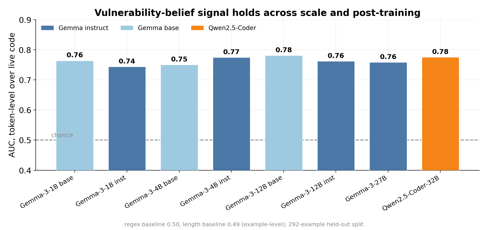
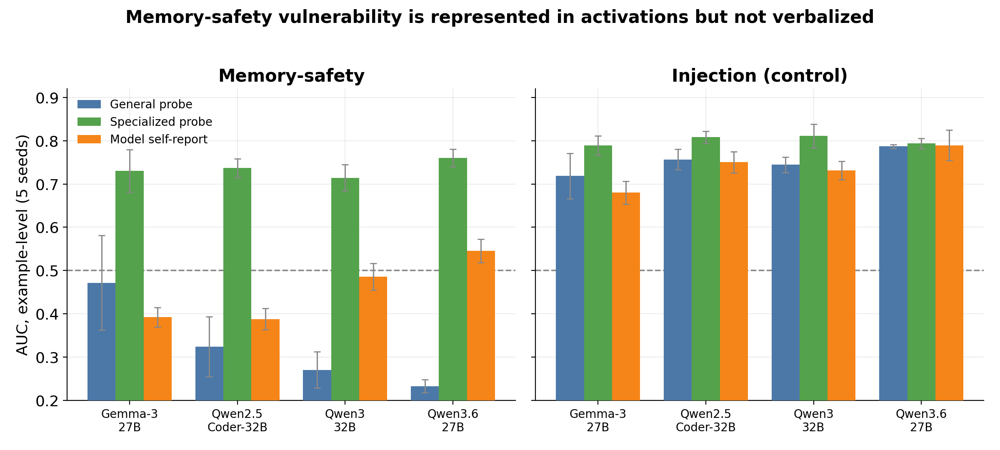
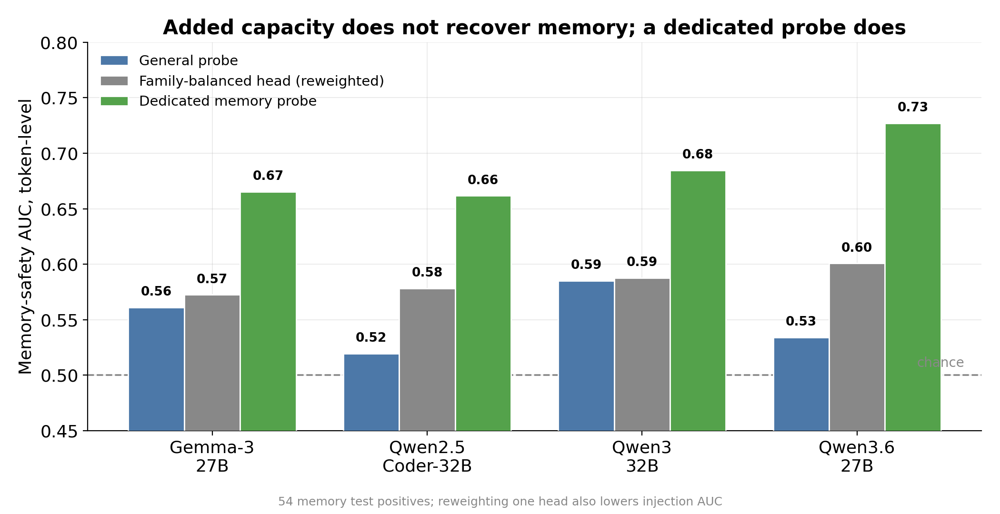
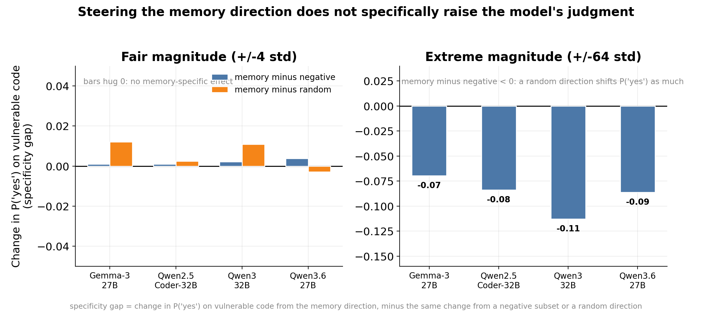
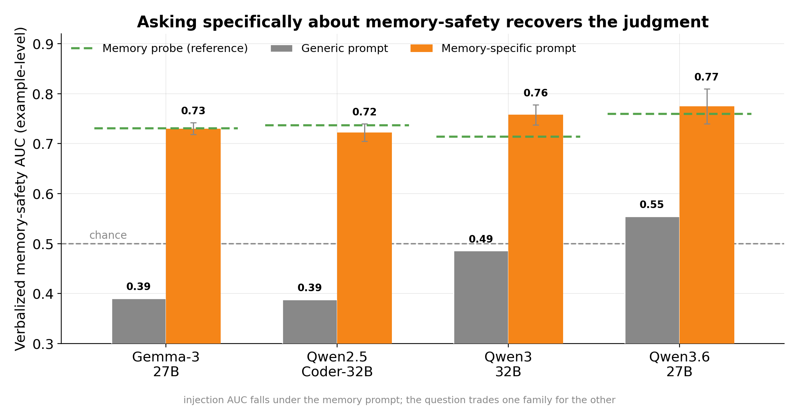
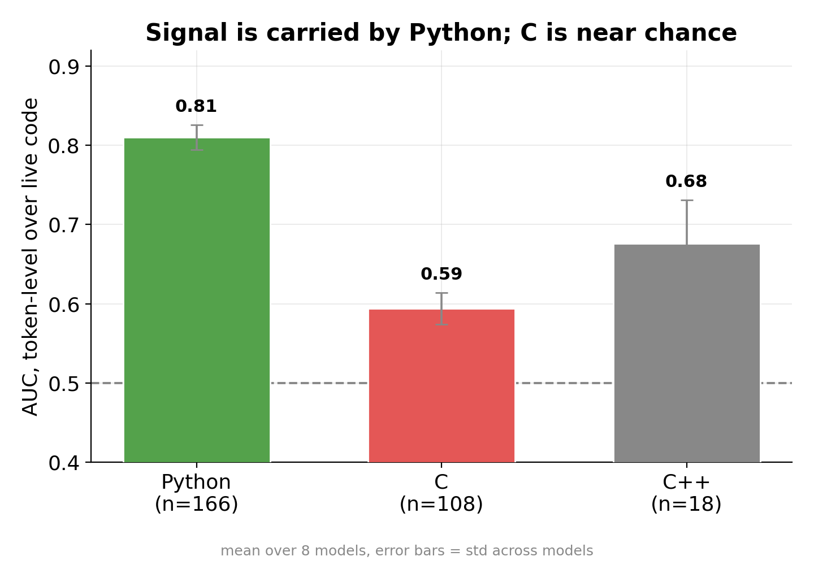
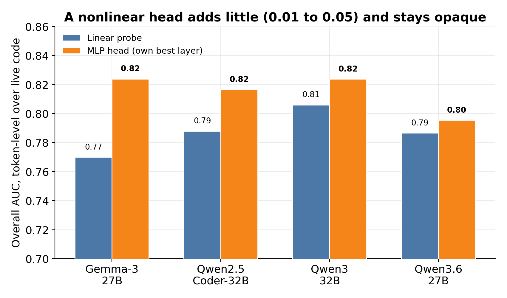

## Summary {.smaller}

:::: {.columns}
::: {.column width="58%"}
- I train linear probes on hidden states to read whether a model judges the code in its input as vulnerable.
- The signal is real and stable across 8 open-weight models, about 0.76 AUC, and it is already present in base models.
- The probe reads injection-class vulnerabilities well. Memory-safety sits near chance.
- For memory-safety the vulnerability is recoverable from the activations while the model does not state it. A dedicated probe reads it above chance, and so does a memory-specific question.
:::
::: {.column width="42%"}

:::
::::

::: {.notes}
This is a synthesis of the cross-model probing work. Two messages set the frame. First, the probing recipe works and is robust. Second, where it works and where it fails is itself the finding: injection yes, memory-safety no, and the memory-safety case turns out to be a verbalization gap rather than an absence of signal.
:::

## Agenda

1. Setup: the property, the probe, the data
2. The signal is real and stable across models
3. An injection detector with a memory-safety blind spot
4. Present in activations, not stated by the model
5. Recovering memory: capacity against specialization
6. A causal test, and a framing fix
7. Status and next steps

::: {.notes}
Ordered by priority. Sections 3 and 4 are the core. If time is short, I would spend it on the injection-versus-memory split and the represented-but-not-verbalized result.
:::

# Setup

## What I am detecting

- The property: the model's own judgment of how vulnerable code in its input stream is. The target is the internal judgment, not ground-truth vulnerability.
- The probe: a linear span-max probe on one layer's hidden states, fit per model. Probes are model-specific, so I refit the same recipe for each model.
- The data: the SVEN dataset of before/after function pairs. The positive is the vulnerable function, the negative is its patched version, so task and topic are held fixed.
- The split: grouped and held out by repository, so the probe cannot memorize a project.
- The probe is fit to the vulnerability label. I read it as a belief only where the next results show it agreeing or diverging from the model's own report.

::: {.notes}
Span-max means I score every code token and take the max over the function. Before/after pairs are the bias control: the only systematic difference between a positive and its negative is the vulnerability, so the probe cannot win on surface features like length or topic. The model roster spans 1B to 32B, base and instruct, Gemma and Qwen.
:::

## How I measure it {.smaller}

- The headline metric is AUC over live-code tokens. I mask comments, imports, and signatures so the probe must read code, not boilerplate.
- Two granularities appear in this deck: token-level AUC for live-code detection, and example-level AUC, one score per function, for the belief audit and prompt sweep, because the model's self-report is one answer per function. Each figure states which.
- I rebuilt the dataset to the before/after contrast after finding a length confound in the earlier construction. That dropped a length baseline from 0.58 to 0.49 and is why I report the token-level metric.
- I also ask the model directly, as a white-box control. The probe has to beat asking.

```text
Does the code above contain a security vulnerability?
Respond with ONLY one word - "yes" or "no" - and nothing else.
```

::: {.notes}
The length confound is important context: an earlier example-level metric was inflated because vulnerable and patched functions differed in length. The before/after rebuild removed that, and the honest signal lives at the token level over live code. The self-report question is the control for every probe result that follows. I read the yes-probability and score its AUC.
:::

# Results

## Does the probe read vulnerability across models?



::: {.notes}
About 0.76 AUC from 1B to 32B, Gemma and Qwen, base and instruct. Two things to note. The base models carry it as strongly as the instruct models, so this is a pretraining feature, not something post-training installed. And it clears the regex and length baselines, which sit near 0.50. The recipe generalizes across the roster.
:::

## What kinds of vulnerability does it read?


::: {.notes}
This is the finding that reframed the project. The single number hides a split. Injection-class vulnerabilities are read well: SQL injection at 0.92, command injection at 0.82. Memory-safety vulnerabilities sit near chance: use-after-free at 0.52. The same split shows up by language, Python around 0.81 and C around 0.59, because the memory-safety cases are the C cases.

The split is a gradient, not a clean binary. XSS at 0.64 is injection-class but weaker, so the real axis tracks the Python against C and the data-flow against spatial-memory boundary more than a tidy two-way label.

One untested alternative explanation belongs here: the probe could be tracking code quality or C-ness rather than vulnerability. The code-quality control is in the status section and is the check I would run first.
:::

## Is the memory-safety signal absent, or just not stated?

{width="80%"}

[Example-level AUC over about 54 held-out memory positives, 5 seeds. The recovery is above chance and modest, not a clean decode.]{.smaller}

::: {.notes}
The key result. For memory-safety, a probe trained specifically on memory-safety reads it at 0.71 to 0.76 example-level, above chance, on about 54 held-out memory positives, so the interval is wide. The model's own self-report is at or below chance, and so is the general probe restricted to memory. The signal is recoverable from the activations while the model does not state it. Injection on the right is the control: there the probe, the general probe, and the self-report all agree and all read high. For an AI-control monitor this is the point: a white-box probe catches what asking the model would miss. Note the metric here is example-level, one score per function, so it is not the same axis as the 0.76 token-level headline.
:::

## Can one general probe hold both families?



::: {.notes}
I asked whether the general probe just under-allocates capacity to memory. Reweighting the training set toward the memory family barely moves memory and it lowers injection. Adding a nonlinear head adds about 0.04 overall and stays opaque. Ensembles of orthogonalized linear directions do not help either. There is roughly one useful linear axis. What recovers memory is a dedicated memory probe, the green bars. Specialization reads memory; added capacity does not.
:::

## Does the memory direction cause the model's judgment?



::: {.notes}
If the memory direction is what drives the model's stated judgment, adding it to the residual stream should raise the yes-probability on memory-vulnerable code. At a fair magnitude, plus or minus four standard deviations along the direction, the change is no larger than for a random direction. At extreme magnitude there is a shift, but it is global: it moves the secure code as much as the vulnerable code, so it is not memory-specific. Under additive steering at the probe layer, the direction reads the property and does not drive the behavior. This scopes to one intervention at one layer family. An earlier run looked causal, but that used a model-breaking magnitude, which is in the backup.
:::

## Can the right question recover the judgment?



::: {.notes}
The verbalization gap is a framing effect, not a hard limit. Asking generically, the self-report on memory is near chance, the grey bars. The orange bars are the best memory-specific wording per model. They lift the verbalized AUC most of the way to the probe, the green reference line: to probe level on the Qwen models, and close on Gemma, where naming the specific CWEs is what closes the rest. The cost is that injection AUC falls under the memory question, because the question trades one family for the other.
:::

## The memory-specific question {.smaller}

Generic, used everywhere above:

```text
Does the code above contain a security vulnerability?
```

Memory-specific, which recovers most of the judgment:

```text
Does the code above contain a memory-safety bug such as a use-after-free,
NULL-pointer dereference, out-of-bounds read/write, or buffer overflow?
```

On Gemma, naming the specific CWEs in the question closes the remaining gap.

::: {.notes}
The only change is the wording of the question. The detailed memory wording recovers most of the gap and reaches probe level on the Qwen models. On Gemma it gets to about 0.67, and naming the four memory CWEs explicitly takes it to about 0.73, matching its memory probe. The previous slide's orange bars use the best wording per model.
:::

# Status

## What stands, and what is next {.smaller}

Established:

- A robust, pretraining-level vulnerability signal across 8 models.
- The injection against memory-safety split.
- Memory-safety is recoverable from activations and not stated by default.
- Specialization recovers memory; the direction is read-only under additive steering at the probe layer.
- The belief audit, steering, and memory recovery rest on the 4 largest models.

Not yet tested:

- External validity: a non-SVEN C vulnerability set, and a code-quality control to rule out tracking quality instead of vulnerability.
- Reading against generation: does a probe fit on read code transfer to generated code.
- Long-context generalization.

Caveats:

- Memory-safety has 54 held-out positives, so per-type memory numbers carry wide intervals.
- Cluster access has ended. The cached activations are large but regenerable.

::: {.notes}
The open question I most want feedback on: is the memory-safety result strong enough to build on before the external-validity checks are in, or should those run first. The code-quality control is the one I would prioritize, because the most likely alternative explanation for the C and memory weakness is that the probe tracks code quality rather than vulnerability.
:::

# Backup

## Signal by language

{width="62%"}

::: {.notes}
The language split that sits underneath the per-type split. Python carries the signal at about 0.81. C is near chance at about 0.59. The memory-safety cases are the C cases, so these are two views of the same gap.
:::

## A nonlinear head does not close the gap

{width="62%"}

::: {.notes}
An MLP head at its own best layer adds between 0.01 and 0.05 overall, about 0.025 on average, and remains uninterpretable. A post-hoc ensemble of linear probes matches it while staying readable. This is why I treat the architecture axis as closed: capacity is not the bottleneck.
:::

## Layer selection {.smaller}

- I select the probe layer by held-out validation. The selected layer is within 0.03 AUC of the oracle layer on every model, and under 0.015 on most.
- The best depth fraction sits mid-to-late, roughly 0.3 to 0.5 on the large models, with two small models selecting the last layer. No single fraction is best for all, so I select per model rather than fixing a layer.

::: {.notes}
This settles the open layer-policy question: validation selection is near-oracle, but a fixed depth fraction is not safe across models, so per-model selection is the rule.
:::

## The earlier steering result {.smaller}

- A first steering run appeared causal: the yes-probability moved from 0.08 to 0.36 on one model.
- That run scaled the push to the median hidden-state norm, which is about 2000 standard deviations along the probe direction. It breaks the model rather than steering it.
- Rescaling to standard-deviation units along the direction gives the flat result in the main section. The corrected verdict is read-only.

::: {.notes}
I am showing this so the contradiction inside the notes is on the record. The early "causal" number was an artifact of an oversized perturbation. The fair-magnitude and wide-grid runs both say read-only.
:::

## Calibration {.smaller}

- The scores are not yet calibrated. Expected calibration error and Platt against temperature scaling are specified but not yet run.
- An AI-control monitor runs at a fixed threshold, so calibration is required before a deployment-style operating point is reported.

::: {.notes}
Flagging an owed piece of work, not a result. The probe is evaluated by AUC so far. A fixed-threshold monitor needs calibrated scores and a reported operating point, which is the next measurement once the external-validity checks are done.
:::
