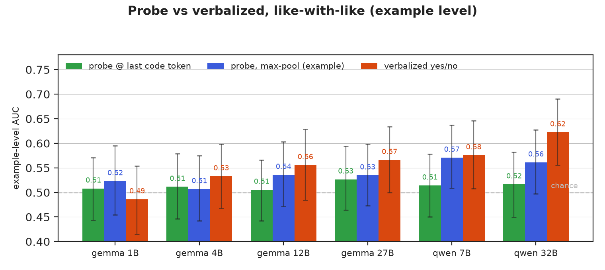

[ai-generated]

# 29 — Last-code-token readout vs verbalized (example-level)

**One line:** at the example level (like-with-like), the span-max probe read at
each function's final live-code token is **chance on all 7 models** (0.51, CIs
include 0.5); the existing max-pool example read is barely above chance; and the
model's **verbalized yes/no is at least as good as any probe read on 5 of 6
models** and the only read that scales with model size. The blog's apparent
"probe ≫ verbalized" was a token-vs-example metric artifact.

**Secondary metric.** Everything here is EXAMPLE-level AUC (one score/function) —
secondary per project-log §3. It does **not** touch the token-level headline
(`tokens_code_auc` 0.75–0.82, untouched and re-verified bit-exact as the gate).

## Numbers (full held-out test, n=292, 146 vuln; 95% bootstrap CI)

| Model (layer) | probe @ last code tok | probe max-pool | verbalized | gate `tokens_code_auc` |
|---|---|---|---|---|
| Qwen-32B (L25) | 0.517 [.45,.58] | 0.561 [.50,.63] | **0.623** [.56,.69] | 0.7758 ✓ |
| Qwen-7B (L16)  | 0.514 [.45,.58] | 0.571 [.51,.64] | 0.576 [.51,.65] | 0.8132 ✓ |
| gemma-1b (L25) | 0.508 [.44,.57] | 0.523 [.45,.59] | 0.486 [.41,.55] | 0.7441 ✓ |
| gemma-4b (L7)  | 0.512 [.45,.58] | 0.507 [.44,.57] | 0.533 [.47,.60] | 0.7748 ✓ |
| gemma-12b (L15)| 0.506 [.44,.57] | 0.536 [.47,.60] | 0.556 [.48,.63] | 0.7627 ✓ |
| gemma-12b-pt (L13)| 0.512 [.45,.57] | 0.563 [.50,.63] | (no verbalized) | 0.7818 ✓ |
| gemma-27b (L19)| 0.527 [.46,.59] | 0.535 [.47,.60] | 0.566 [.50,.63] | 0.7587 ✓ |

Paired probe−verbalized Δ (shared bootstrap resamples): on the **full test** the
only CI-separated contrast is Qwen-32B **verbalized > last-code-token probe**
(Δ −0.106 [−0.182, −0.032]). On the canonical **subtractive subset** (n=194, 97
vuln) verbalized CI-beats the last-code-token probe on **three** models (Qwen-32B
Δ −0.181, Qwen-7B −0.121, gemma-12b-it −0.106). The probe **max-pool** vs
verbalized Δ straddles 0 on every model/pool — that contrast is a genuine wash
(e.g. Qwen-7B subtractive max-pool 0.645 ≈ verbalized 0.640). Last-code-token
stays at chance (0.51–0.53) on the subtractive subset too.

## What it means

- **Last-token read carries no *extra* example-level signal at the final code
  position.** The span-max probe's vulnerability signal is *distributed* across
  code tokens (the lexical string-sink behaviour of exp-20/24), not concentrated
  at the final position; collapsed to that single token it is chance on every
  model. (The token-level headline `tokens_code_auc` 0.75–0.82 is unaffected — a
  distributed signal is still a signal.) NB this is the last *code* token in the
  raw-code format, **not** the `Assistant:` turn-boundary of the blog's NXT2b —
  that position only exists in the verbalized QA format and its hidden state was
  never saved, so the true introspection probe still needs a (small) extraction.
- **Fixes the blog's metric mismatch.** fig-verbalized plotted probe TOKEN-AUC
  (~0.78) against verbalized EXAMPLE-AUC (~0.5–0.62). Compared like-with-like
  (both example level), no probe read beats verbalized; on Qwen-32B verbalized
  CI-beats the last-token probe. "Probe is the better reader" is not supported at
  the example level.
- **Reconciliation — this REVERSES exp-05's Gemma "introspection gap," it does
  not confirm it.** exp-05/ledger-#5 reported probe > verbalized for Gemma
  (+0.09), but that probe AUC was example-level **max-pool scored in-sample on
  the full 1430** (training examples included), with fresh 5-seed probes at a
  per-model layer. exp-29 scores the *single deployed* exp-16 probe on the
  **held-out 292**: gemma-27b max-pool 0.535 < verbalized 0.566. So the Gemma
  introspection gap does **not** survive held-out evaluation with the deployed
  probe — the reversal is from in-sample inflation + layer/probe-instance, **not**
  the token-vs-example axis. For **Qwen**, exp-05 and exp-29 agree (verbalized
  ≥ probe). Ledger #5 updated accordingly.
- **Verbalized shows the clearest size trend** of the example-level reads
  (gemma 1B→27B 0.49→0.57; Qwen-32B 0.62); mean-pool rises weakly across Gemma
  too. Consistent with the verbalized-scales observation in exp-05/17.

## Provenance note (reduced path)

5 of 7 models are scored from `lasttok_reduced.json` — a cluster-side numpy
reduction of the 7 MB per-token npz (the cluster's file-transfer API cannot move the full npz; the
reducer is `reduce_logits.py`, run under the cluster harness). The hard gate on
those 5 checks the *scalar* `tokens_code_auc` against exp-16's stored value
(bit-exact, ≤1e-16 in practice), which proves logit/is_code/is_test/eid integrity
but **not** the per-example last/max/mean reduction line-by-line. They are
re-derivable only by re-running `reduce_logits.py` on the npz, not from committed
artifacts. The 2 anchors (Qwen-32B, gemma-1b) are scored from the full local npz
end-to-end and carry the full gate.

## For agents

- Reproduce: `.venv29/bin/python score_last_token.py` (CPU, ~30 s);
  `fig_last_token.py` for the figure. Inputs: exp-16 `logits_layer{NN}.npz`
  (2 anchors local; other 5 read from `lasttok_reduced.json`, a cluster-side
  numpy reduction of the 7 MB npz — the cluster's file-transfer API can't move the full npz).
- Gates (hard-fail, all passed): recomputed `tokens_code_auc` == exp-16 stored
  (bit-exact for npz; ≤1e-4 for the reduced numpy-rank-AUC path); verbalized AUC
  == exp-17 `verbalized_auc_test`; eid token-row contiguity asserted.
- Reads use the raw **logit** (AUC(max logit) ≡ AUC(max prob), but no float32
  sigmoid-saturation ties). True function label (`row['label']`) for all reads so
  probe and verbalized share the exact axis. Subtractive subset =
  exp-19 `subtractive_membership.json` `kept_eids` (the canonical ADR-0004 set).
- Dual review: design review (codex + Opus) pre-run → GO-WITH-FIXES, all
  blocking fixes applied (vacuous gate → tokens_code_auc gate; prob→logit;
  markable→canonical subtractive; verbalized gate; loud-fail on missing;
  no-torch). Result review gate → see commit.
