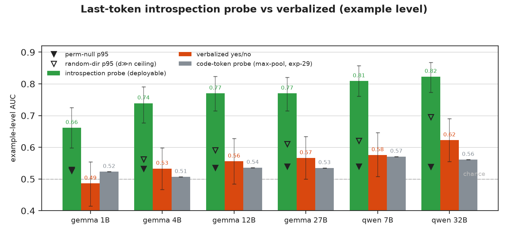

[ai-generated]

> **⚠ TEMPERED BY exp-31 (read it alongside this).** The two controls in exp-31
> dissolve the "positive" below: a char-n-gram surface baseline on the raw code
> text scores 0.778 example-AUC — only Qwen-32B-primed clears it with a
> CI-separated margin (11 of 12 probe cells do not), and that lone cell is
> priming-dependent — it vanishes under a neutral prompt. **Net verdict:
> commit-position decodability is LEXICAL.** What survives: probe > verbalized,
> probe clears the nulls. The numbers below stand; the *framing* is superseded by
> exp-31 RESULTS.md + finding #8.

# 30 — Last-token introspection probe (the `Assistant:` turn-boundary)

**One line:** a linear probe on the hidden state at the **answer-commit position**
(the last prompt token of the verbalized QA format, where the model is about to
emit yes/no) **linearly decodes the SVEN vulnerability label at 0.66–0.82
example-level AUC** — far above the model's own verbalized yes/no (0.49–0.62, Δ
+0.18 to +0.23, all CI-separated) and far above the code-token probe at the
example level (exp-29 max-pool 0.51–0.57). It clears a label-permutation null
(p=0.001 every model, probe > null max) and beats all 2000 random directions, and
is not language or length (both example-level baselines ≈ chance). **The signal is
mostly Python** (within-Py 0.75–0.92 vs within-C/C++ 0.53–0.62). **What it is
remains open:** the controls rule out language/length/selection-overfit, but NOT
surface/lexical features the model has encoded at that position — so this is
*decodability*, not a demonstrated "vulnerability belief." A lexical/surface
baseline at this position (the exp-24 control, example-level) is the needed next
step before any "the model knows" reading.

**Secondary, example-level — and a NEW position.** This is example-level AUC (one
commit-position vector per function), the only sensible metric for a single
position. It does **not** revise the token-level code-token headline
(`tokens_code_auc` 0.75–0.82, which is the lexical string-sink read of exp-20/24/29
and stands). It is a *different probe at a different position*, and it is a
positive: the negative conclusion of the prior work ("a probe at code-token
positions mostly re-derives grep") does not extend to the commit position.

## Numbers (held-out test n=292, 146 vuln; deployable = val-selected layer+C)

| Model | layer (of) | probe test AUC [95% CI] | verbalized | Δ probe−verb [CI] | perm-null p (p95/max) | within-Py | within-C |
|---|---|---|---|---|---|---|---|---|
| Qwen-32B | L60 (64) | **0.823** [.77,.87] | 0.623 | +0.200 [+.13,+.28] | 0.001 (.54/.60) | 0.919 | 0.622 |
| Qwen-7B  | L24 (28) | **0.809** [.76,.86] | 0.576 | +0.233 [+.16,+.31] | 0.001 (.54/.58) | 0.910 | 0.589 |
| gemma-1b | L4 (26)  | 0.662 [.60,.73] | 0.486 | +0.175 [+.08,+.27] | 0.001 (.53/.57) | 0.752 | 0.529 |
| gemma-4b | L21 (34) | 0.739 [.68,.79] | 0.533 | +0.206 [+.13,+.28] | 0.001 (.53/.56) | 0.829 | 0.550 |
| gemma-12b| L28 (48) | 0.770 [.72,.82] | 0.556 | +0.214 [+.14,+.29] | 0.001 (.54/.58) | 0.873 | 0.571 |
| gemma-27b| L41 (62) | 0.770 [.72,.82] | 0.566 | +0.204 [+.13,+.27] | 0.001 (.54/.62) | 0.871 | 0.574 |

Confounds (all models): example-level **language indicator AUC = 0.500**,
code-length AUC = 0.491 (each vuln is paired with its own-language fix, so neither
separates the classes at the example level). Deployable ≈ oracle (within 0.02–0.03)
→ honest layer selection. Verbalized re-AUC reproduced exp-17 (hard gate passed).

## What it means

- **The label is far more decodable at the commit position than from the model's
  own answer.** Asking the model gives 0.49–0.62; a linear read of the *same
  position's* hidden state gives 0.66–0.82 (Δ +0.18 to +0.23, every CI excludes 0).
  So the position carries vulnerability-relevant structure the yes/no token does
  not expose — consistent with "knowledge present but lossily verbalized," but see
  the lexical caveat: this is decodability, not a proven belief.
- **Not an artifact (the guards hold).** (1) label-permutation null (reselects the
  layer on shuffled train/val labels at the deployable C, test labels intact):
  p=0.001, every probe exceeds the perm-null *max*; a stronger full-C-resweep null
  on gemma-1b is equivalent (p95 0.525). (2) beats all 2000 random directions; (3)
  language and length example-level baselines ≈ chance; (4) deployable≈oracle layer.
- **Answer-readout: excluded for gemma-1b, open for the large models.** gemma-1b's
  signal peaks *early* (L4/L6, 15–23% depth; late layers only ~0.60) and its probe
  score is uncorrelated with the model's verbalized P(yes) (Spearman −0.08) — so
  there it is not a re-read of the yes/no computation. But Qwen-32B (L60/64) and
  gemma-27b peak late, so a readout contribution is **not excluded** for the large
  models without a per-layer curve or a yes/no-direction comparison (TODO).
- **Mostly Python (the honest limit).** The headline is Python-driven (within-Py
  0.75–0.92); within C/C++ it is 0.53–0.62 — modest, though for the bigger models
  (0.57–0.62) it is the strongest C signal the project has produced and above the
  code-token C probe. So: strong commit-position decodability in Python, weak in C.
- **Lexicality unresolved (the key open control).** Language and length are ruled
  out, but a char-n-gram/token surface baseline (exp-24) at the example level is
  NOT yet run. Given exp-20/24/29's lexical-ceiling result, the probe's signal
  could be surface features the model has encoded at the commit position. "Probe >
  surface here" would be the first genuinely non-lexical result in the project;
  "probe ≈ surface" would fold it back into the lexical story. Until then, claim
  only decodability above verbalized + code-token, not "non-lexical / belief."
- **d≫n honesty.** hidden_dim ≫ n_train, and at the late deployable layers random
  directions reach AUC ~0.62–0.70 (p95) by sampling variance at n_test=292. The
  trained probe (0.66–0.82) exceeds every random draw, and the tighter permutation
  null (p95 ≈ 0.53–0.54) is smashed — but the figure marks the random ceiling too;
  do not claim the full margin over 0.5.

## For agents

- **Metric**: example-level AUC = SECONDARY per project-log §3, but it is the
  *only* metric for a one-position probe and here carries a POSITIVE finding at a
  NEW position. Do NOT phrase as revising the token-level code-token headline.
- **Position**: last prompt token (index −1) of exp-17's verbalized QA render
  (debug print confirmed the tail is the assistant turn-start, no `<think>`, yes/no
  dominate). Same position as verbalized P(yes); repo-layer L = `hidden_states[L+1]`.
- **Pipeline**: extract (GPU, exp-17 forward + `output_hidden_states`, float32) →
  merge (coverage-gated) → train (`train_introspection_probe.py`, CPU, loky-parallel
  on 288 cores). All on cluster; results JSON fetched. Hidden npz KEPT on scratch.
- **Nulls**: label-permutation (N=1000, full select rerun on shuffled train/val,
  test intact, p=(1+#≥)/(N+1)) + random-direction (N=2000, untrained, at deployable
  layer). Gate: verbalized re-AUC == exp-17 (hard-fail), npz label == dataset.
- **Open**: is "introspection" the right word, or "the model's internal vuln
  classifier read before the lossy softmax"? Mechanistically the latter; either way
  it is a strong cheap monitor signal. Next: per-layer AUC curve (where the signal
  emerges), C/C++-specific probing, and the generation pivot (NXT3).
- **Review**: design review (codex+Opus) → GO-WITH-FIXES (applied). Result review
  gate (codex+Opus) pending before this reaches the user / ledger.
