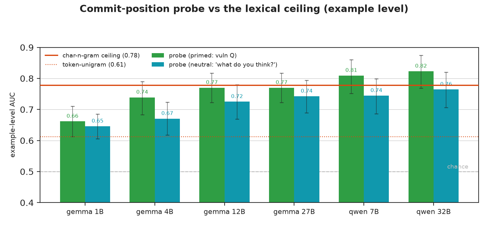

[ai-generated]

# 31 — Neutral-prompt commit probe + surface baseline: exp-30 folds into the lexical ceiling

**One line:** the exp-30 commit-position positive does **not** survive its two
controls. (1) A char-n-gram surface classifier on the raw code text scores **0.778**
example-AUC — no probe clears it with a CI-separated margin except one cell. (2) The single
above-ceiling cell (Qwen-32B primed, Δ +0.045 over char) is **priming-dependent**:
under a neutral prompt it drops to the ceiling (Δ −0.013, ns). So commit-position
vulnerability decodability is **lexical** — it folds into the exp-20/24/29
lexical-ceiling story. What survives: the probe still beats the model's own
verbalized yes/no, and the signal clears permutation/random nulls (it decodes real
structure) — but a char-n-gram decodes it as well or better.

**Secondary, example-level**; token-level headline untouched. This RETRACTS the
exp-30 framing "first strong reading-frame positive" → "at the lexical ceiling,
like everything else."

## Numbers (held-out n=292; 141 held-out groups; pair-clustered bootstrap)

Surface on raw code text: **char-n-gram 0.778** [.724,.830] (strongest of 3 configs;
char_wb-3-5 0.760, char-3-7 0.772), token-unigram 0.613.

| Model | primed probe | Δ vs char(.778) | neutral probe | Δ vs char | verbalized |
|---|---|---|---|---|---|
| Qwen-32B | 0.823 | **+0.045 [+.009,+.082]** | 0.764 | −0.013 [−.053,+.024] | 0.623 |
| Qwen-7B | 0.809 | +0.031 [−.007,+.066] | 0.744 | −0.034 [−.073,+.001] | 0.576 |
| gemma-1b | 0.662 | −0.116 [−.152,−.079] | 0.646 | −0.132 [−.172,−.093] | 0.486 |
| gemma-4b | 0.739 | −0.039 [−.082,+.004] | 0.670 | −0.107 [−.155,−.060] | 0.533 |
| gemma-12b | 0.770 | −0.008 [−.044,+.029] | 0.725 | −0.053 [−.092,−.018] | 0.556 |
| gemma-27b | 0.770 | −0.007 [−.054,+.037] | 0.742 | −0.035 [−.072,−.003] | 0.566 |

(Δ = probe − strongest-char, paired clustered bootstrap; CI excluding 0 in **bold**.)

## What it means

- **Mostly/entirely lexical.** Only **1 of 12** probe cells (Qwen-32B primed)
  clears the char ceiling with a CI-separated margin (+0.045); the other 11 do not
  (at the point estimate char also numerically tops 4/6 primed — all but the two
  Qwens — and all 6 neutral; gemma-1b probe 0.66 ≪ char 0.778). And that one cell
  is exploratory (no multiplicity correction) **and** dissolves under de-priming
  (neutral Qwen-32B Δ −0.013, ns). There is no robust, intrinsic above-lexical
  signal at the commit position.
- **The neutral prompt is the decisive control.** De-priming ("What do you think
  about this code?" instead of asking about vulnerability) drops the probe ~0.02–0.07
  and pushes the one above-ceiling cell back to the ceiling — consistent with
  Qwen-32B's primed edge being *priming-dependent* (it appears only when the vuln
  question is present), i.e. not a prompt-independent above-lexical representation.
  The neutral probe is genuine (clears nulls, beats verbalized) but
  lexical (≤ char).
- **What still holds from exp-30.** The probe beats the model's own verbalized
  yes/no everywhere (primed Δ +0.18–0.23, neutral +0.14–0.18, all CI-sep) — reading
  activations is better than asking the model. And the probe clears permutation +
  random-direction nulls — it decodes real structure. But that structure is lexical:
  a char-n-gram on the text matches or beats it.
- **gemma-1b is below char by a lot** (0.662/0.646 vs 0.778) — the small model's
  commit state encodes *less* than a char-n-gram captures.
- **Consistency with the project.** This extends the lexical-ceiling conclusion
  (exp-20/24/29) to a new position (commit) and a new prompt (neutral). The methodology
  (surface baseline + de-priming) caught what looked like a breakthrough.

## For agents

- Reproduce: `surface_baseline.py` (CPU, reads kept primed+neutral npz +
  exp-30/31 probe JSONs). char configs char_wb-3-5/char-3-5-100k/char-3-7-200k
  (strongest = ceiling); token-unigram. Vectorizer fit TRAIN-only; C on val;
  refit train+val; test transform-only. **Pair-clustered bootstrap** (resample the
  141 groups, not 292 rows — the honest unit). Probe refit gated to reproduce
  exp-30/31 deployable AUC (≤2e-3).
- Neutral extraction: exp-30 extractor `--question "What do you think about this
  code?"`; trainer `--no-verbalized-gate --hidden-glob lasttoken_hidden_neutral_{slug}.npz`.
  Neutral probe still clears nulls (perm p=0.001, rand p=0.000) + beats verbalized,
  Python-concentrated (within-Py 0.72–0.85, within-C 0.52–0.57).
- **Caveat on scope:** char-n-gram ranges 0.760–0.778 across reasonable configs;
  the verdict (probe ≤ ceiling, Qwen-32B-primed the lone exploratory exception that
  de-priming kills) is stable across them.
- Dual-reviewed (methodology + result). Update exp-30 finding #8 / ledger to the
  tempered verdict.
